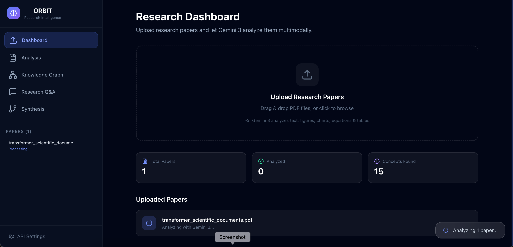
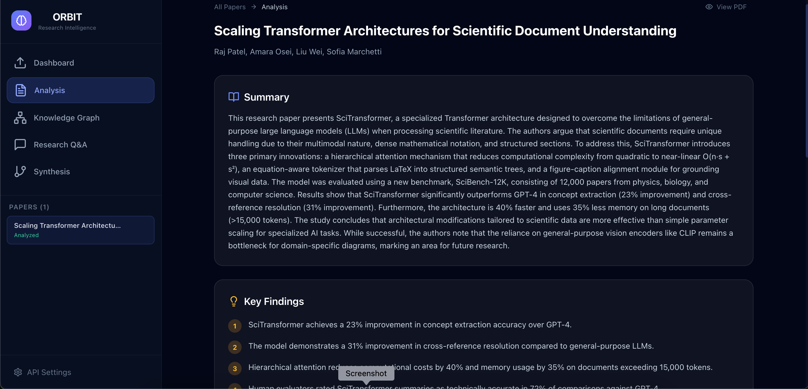
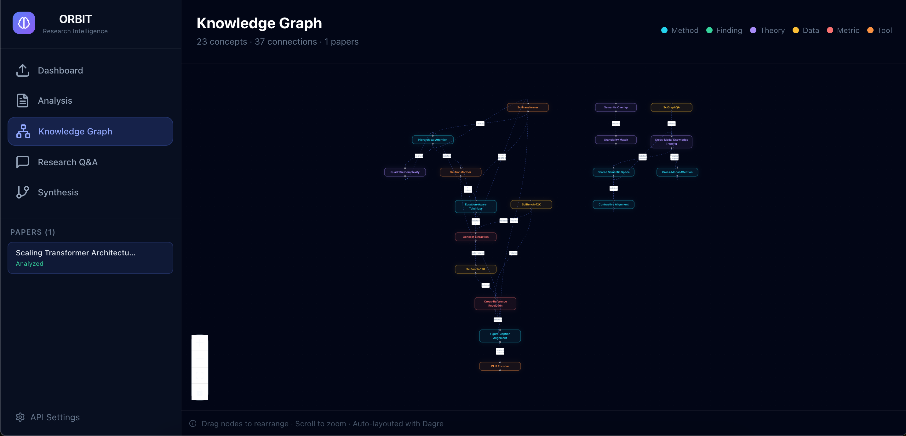
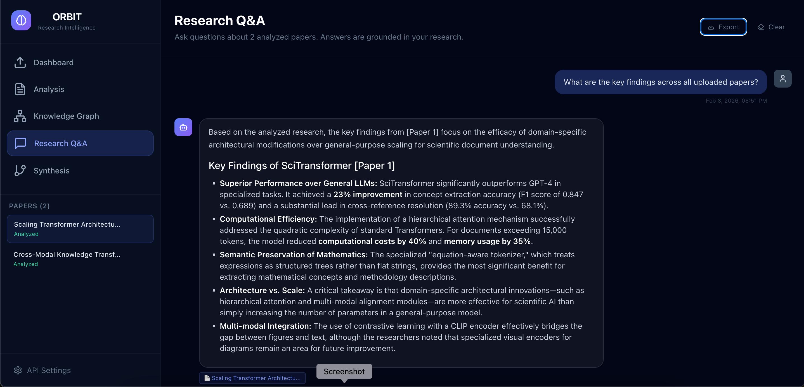
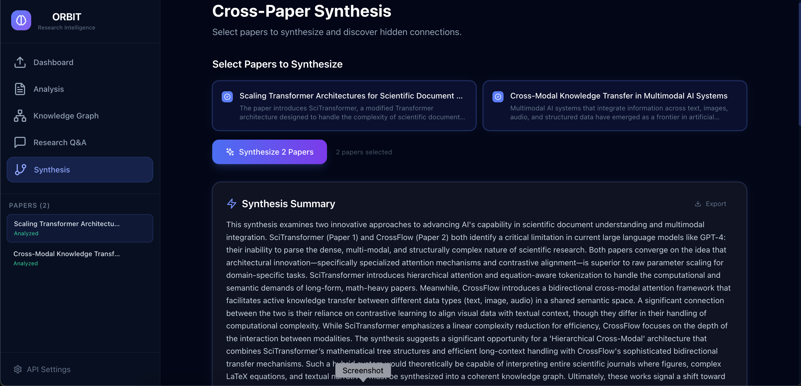

# 🌌 ORBIT — Open Research Breakthrough Intelligence Tool

**Upload research papers → Discover connections → Generate new hypotheses. In minutes, not months.**

Built for the [Gemini 3 Hackathon 2026](https://devpost.com).

[](https://ai.google.dev)
[](https://nextjs.org)
[](https://www.typescriptlang.org)

---

## The Problem

Researchers spend **30–50% of their time** just reviewing existing literature. Reading papers one by one, manually tracking findings, searching for connections between studies — it's slow, tedious, and things get missed.

ORBIT fixes that.

## What ORBIT Does

ORBIT is a research intelligence tool powered by **Gemini 3**. You upload PDFs, and it:

1. **Analyzes papers multimodally** — understands text, figures, charts, equations, and tables together (not just text extraction)
2. **Builds an interactive knowledge graph** — auto-maps concept relationships across all your papers
3. **Answers research questions** — ask complex questions, get answers with citations back to source material
4. **Synthesizes across papers** — finds connections, contradictions, and gaps you'd miss manually
5. **Generates hypotheses** — suggests novel research directions from identified gaps

## Screenshots

<!-- Replace these with actual screenshots from the running app -->

| Dashboard & Upload | Paper Analysis | Knowledge Graph |
|---|---|---|
|  |  |  |

| Research Q&A | Cross-Paper Synthesis |
|---|---|
|  |  |

## Demo

🎥 **[Watch the demo video](https://youtu.be/SAxc2XTS5Lw)** (~3 minutes)

🌐 **[Try the live demo](https://gemini-orbit.vercel.app)**

### Quick Test Steps

1. Open the app and click **Start Analyzing**
2. Upload any research paper PDF (drag & drop works)
3. Wait for Gemini 3 to finish analyzing (~15–30 seconds)
4. Click into the **Analysis** tab to see extracted findings, concepts, methodology
5. Go to **Knowledge Graph** to see concept relationships visualized
6. Open **Research Q&A** and ask: *"What are the key findings across all papers?"*
7. Upload a second paper, then use **Synthesis** to discover cross-paper connections

## How Gemini 3 Powers This

This isn't a chat wrapper. Gemini 3 is the core engine for every feature:

### Gemini 3 Features Used

| Feature | How ORBIT Uses It |
|---------|------------------|
| **Multimodal understanding** | PDFs sent as base64 — Gemini reads text, figures, charts, tables, and equations simultaneously |
| **Structured extraction** | Returns typed JSON with concepts, findings, methodology, limitations — not free-form text |
| **Long-context reasoning** | Entire paper contents fed as context for Q&A — grounded answers with `[Paper N]` citations |
| **Cross-document synthesis** | Multiple paper summaries analyzed together to find connections, contradictions, and gaps |
| **Hypothesis generation** | Identifies research gaps and proposes novel, testable research directions |

### API Endpoints

**`/api/analyze`** — Multimodal Paper Analysis
- Sends entire PDF as base64 inline data to `gemini-3-flash-preview`
- Uses `systemInstruction` with `responseMimeType: "application/json"` for structured output
- Extracts: title, authors, abstract, key findings, methodology, concepts (categorized + scored), equations, limitations, future work

**`/api/chat`** — Research Q&A
- Builds proper multi-turn `contents[]` with `user`/`model` roles
- All analyzed paper context injected via `systemInstruction`
- Gemini generates grounded answers with paper citations

**`/api/synthesize`** — Cross-Paper Synthesis
- Feeds summaries, findings, methodologies, and concepts from multiple papers
- Gemini identifies connections (supports/extends/applies/references), contradictions, research gaps
- Generates novel hypotheses — creative but scientifically grounded

## Architecture

```
┌─────────────────────────────────────────────────────────────┐
│                        ORBIT UI (Next.js)                    │
│  ┌──────────┐ ┌──────────┐ ┌──────────┐ ┌───────────────┐  │
│  │ Landing   │ │Dashboard │ │ Analysis │ │ Knowledge     │  │
│  │ Page      │ │& Upload  │ │ View     │ │ Graph (React  │  │
│  │           │ │(Dropzone)│ │          │ │ Flow + Dagre) │  │
│  └──────────┘ └──────────┘ └──────────┘ └───────────────┘  │
│  ┌──────────────────┐ ┌─────────────────────────────────┐   │
│  │ Research Q&A     │ │ Cross-Paper Synthesis            │   │
│  │ (Chat Interface) │ │ (Connections, Gaps, Hypotheses)  │   │
│  └──────────────────┘ └─────────────────────────────────┘   │
├─────────────────────────────────────────────────────────────┤
│                   State Management (Zustand)                 │
├─────────────────────────────────────────────────────────────┤
│                  Next.js API Routes                          │
│  ┌──────────────┐ ┌──────────────┐ ┌──────────────────────┐ │
│  │ /api/analyze  │ │ /api/chat    │ │ /api/synthesize      │ │
│  │ PDF → Gemini  │ │ Q&A with     │ │ Multi-paper          │ │
│  │ multimodal    │ │ context      │ │ synthesis            │ │
│  └──────────────┘ └──────────────┘ └──────────────────────┘ │
├─────────────────────────────────────────────────────────────┤
│          Google Gemini 3 API (gemini-3-flash-preview)        │
│  • Multimodal PDF analysis (text + figures + equations)      │
│  • Contextual Q&A with paper grounding                       │
│  • Cross-paper synthesis & hypothesis generation             │
└─────────────────────────────────────────────────────────────┘
```

## Tech Stack

| Technology | Why |
|------------|-----|
| **Gemini 3** (`gemini-3-flash-preview`) | Core AI — multimodal analysis, reasoning, synthesis |
| **Next.js 14** | Full-stack React framework with API routes |
| **TypeScript** | Type safety across the whole codebase |
| **Tailwind CSS** | Custom dark theme with glassmorphism effects |
| **React Flow + Dagre** | Interactive knowledge graph with auto-layout |
| **Framer Motion** | Animations and transitions |
| **Zustand** | Lightweight state management with persistence |
| **react-dropzone** | Drag & drop PDF upload |
| **react-markdown + KaTeX** | Markdown rendering and equation display |

## Run It Locally

```bash
git clone https://github.com/AdekunleBamz/orbit.git
cd orbit
npm install
echo "GEMINI_API_KEY=your_key_here" > .env.local
npm run dev
```

Open [http://localhost:3000](http://localhost:3000). You can also set your API key in the app via **API Settings** in the sidebar.

## Who This Is For

- **Researchers** — accelerate literature reviews from days to minutes
- **Students** — understand complex papers through interactive Q&A
- **Journalists** — quickly grasp scientific findings for reporting
- **Policymakers** — synthesize research evidence for decision-making
- **Interdisciplinary teams** — find cross-field connections automatically

## License

MIT

---

<p align="center">
  Built for the <strong>Gemini 3 Hackathon 2026</strong><br>
  Powered by Google Gemini 3
</p>
